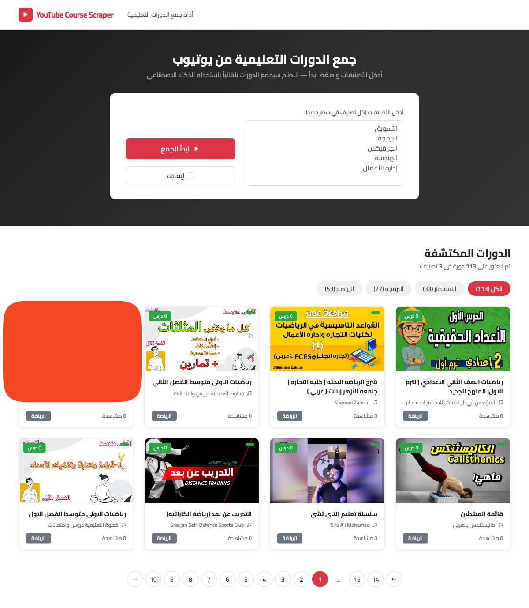
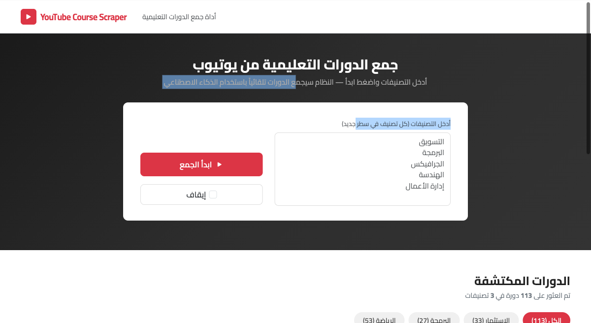
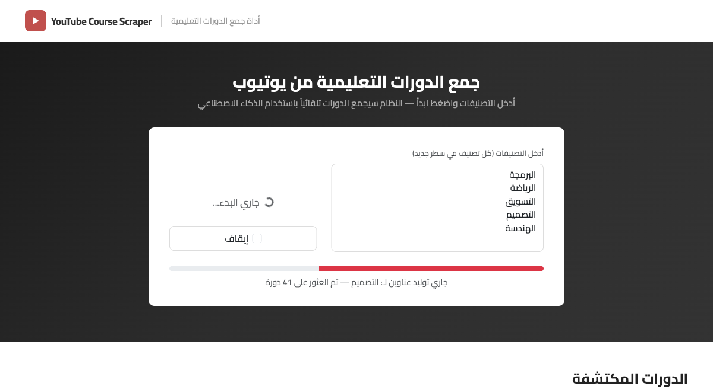
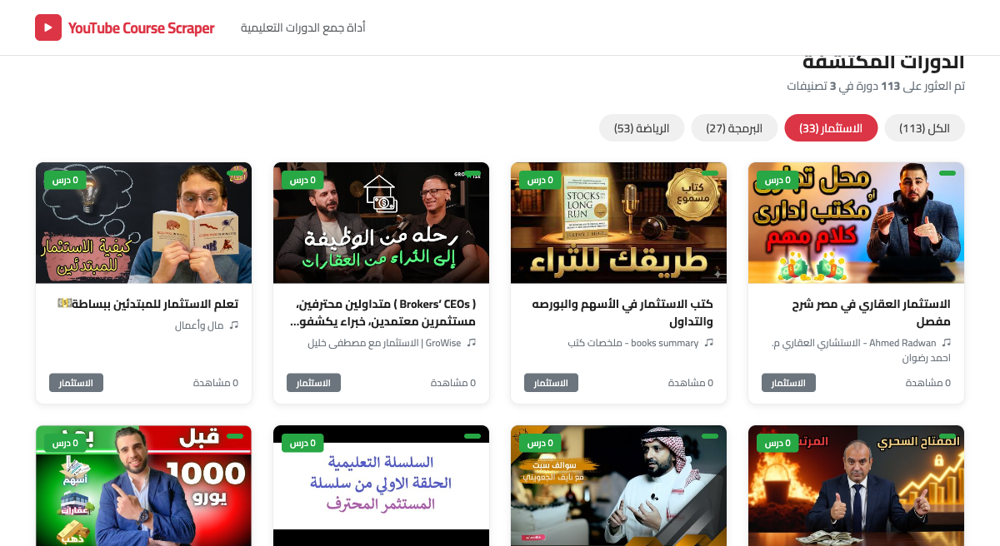
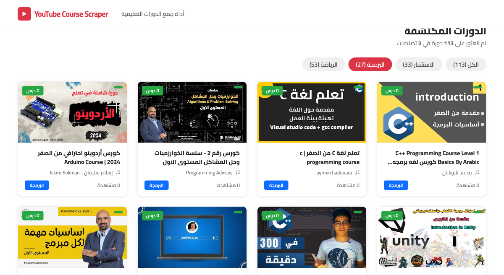
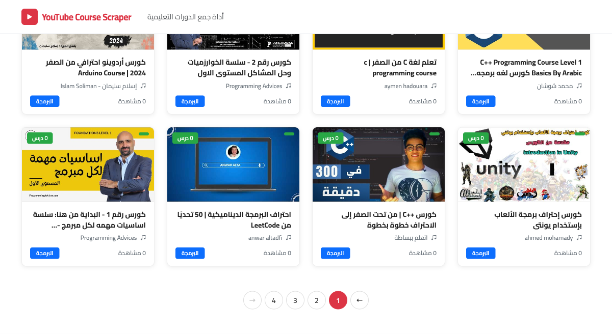

# YouTube Course Scraper

A Laravel-based web application that discovers educational YouTube playlists (courses) using AI-generated search queries and displays them in a card-based Arabic RTL user interface.



---

## Table of Contents

- [Features](#features)
- [Screenshots](#screenshots)
- [Tech Stack](#tech-stack)
- [Architecture](#architecture)
- [Database Design](#database-design)
- [Requirements](#requirements)
- [Installation & Setup](#installation--setup)
- [API Keys Configuration](#api-keys-configuration)
- [Running the Application](#running-the-application)
- [How It Works](#how-it-works)
- [Project Structure](#project-structure)
- [Deduplication Logic](#deduplication-logic)

---

## Features

- **AI-Powered Search**: Uses OpenAI GPT-3.5-turbo to generate 10-20 diverse Arabic course search queries per category
- **YouTube Integration**: Searches YouTube Data API v3 for playlists, storing 2 playlists per query
- **Background Processing**: Queued jobs handle the fetching process asynchronously with real-time progress tracking
- **Deduplication**: Prevents duplicate playlists using unique `playlist_id` constraint at both application and database level
- **Category Filtering**: Filter discovered courses by category with dynamic count badges
- **Pagination**: Numbered pagination with 8 courses per page
- **Stop Control**: Users can halt the fetching process mid-execution
- **RTL Arabic UI**: Fully right-to-left Arabic interface built with Bootstrap 5

---

## Screenshots

### Hero Section — Category Input
Users enter categories (one per line) in the textarea. The interface supports Arabic RTL input with a clear call-to-action button.



### Fetching In Progress
When the user clicks "ابدأ الجمع" (Start Fetching), a background job processes each category. The progress bar updates in real-time showing the current search query and total courses found.



### Discovered Courses Grid
Courses are displayed in a 4-column responsive grid with thumbnails, video count badges, channel names, view counts, and color-coded category tags.



### Category Filtering
Users can filter courses by clicking category pill tabs. Each tab shows the count of courses in that category. The active tab is highlighted in red.



### Pagination
Numbered pagination at the bottom allows browsing through all discovered courses, with the active page highlighted in a red circle.



---

## Tech Stack

| Technology | Purpose |
|---|---|
| **Laravel 13** | Backend framework |
| **PHP 8.4** | Server-side language |
| **MySQL 8** | Database |
| **OpenAI GPT-3.5-turbo** | AI course title generation |
| **YouTube Data API v3** | Playlist search and metadata |
| **Bootstrap 5 (RTL)** | Frontend CSS framework |
| **Blade** | Templating engine |
| **Laravel Queue** | Background job processing |

---

## Architecture

The application follows a clean service-oriented architecture:

```
Request Flow:
┌──────────┐     ┌─────────────────┐     ┌──────────────────────────┐
│  User    │────>│ FetchController │────>│ ProcessCategoriesJob     │
│  Input   │     │ (start/stop)    │     │ (queued background job)  │
└──────────┘     └─────────────────┘     └────────┬────────┬────────┘
                                                  │        │
                                         ┌────────▼──┐  ┌──▼──────────┐
                                         │ OpenAI    │  │ YouTube     │
                                         │ Service   │  │ Service     │
                                         │           │  │             │
                                         │ Generate  │  │ Search      │
                                         │ 15 titles │  │ playlists   │
                                         │ per       │  │ (2 per      │
                                         │ category  │  │ query)      │
                                         └───────────┘  └──────┬──────┘
                                                               │
                                                        ┌──────▼──────┐
                                                        │  Database   │
                                                        │  (dedup +   │
                                                        │   store)    │
                                                        └─────────────┘
```

### Backend Components

| Component | File | Responsibility |
|---|---|---|
| **OpenAiService** | `app/Services/OpenAiService.php` | Sends prompts to GPT-3.5-turbo to generate 15 Arabic course search queries per category. Includes fallback titles if API fails. |
| **YouTubeService** | `app/Services/YouTubeService.php` | Calls YouTube `search.list` (type=playlist, maxResults=2) and `playlists.list` for video count and statistics. |
| **ProcessCategoriesJob** | `app/Jobs/ProcessCategoriesJob.php` | Queued job that orchestrates the full pipeline: iterates categories → generates titles → searches YouTube → stores with dedup. Updates progress in real-time. |
| **HomeController** | `app/Http/Controllers/HomeController.php` | Renders the main page with existing playlists and category counts. |
| **FetchController** | `app/Http/Controllers/FetchController.php` | Handles start (dispatches job), status (returns progress JSON), and stop (sets stopped flag). |
| **PlaylistController** | `app/Http/Controllers/PlaylistController.php` | Returns paginated playlists as JSON, filterable by category. |

### Frontend Components

| Component | File | Responsibility |
|---|---|---|
| **Layout** | `resources/views/layouts/app.blade.php` | Base HTML with Bootstrap 5 RTL, Cairo font, and custom CSS. |
| **Home View** | `resources/views/home.blade.php` | Main page: hero section, category tabs, card grid, pagination, and all JavaScript (AJAX polling, filtering). |
| **Custom CSS** | `public/css/app.css` | RTL styling, card design, category tags, progress bar, pagination, and responsive breakpoints. |

---

## Database Design

### `playlists` Table

| Column | Type | Description |
|---|---|---|
| `id` | bigIncrements | Primary key |
| `playlist_id` | string(64), unique | YouTube playlist ID — deduplication key |
| `title` | string(500) | Playlist title |
| `description` | text, nullable | Playlist description |
| `thumbnail` | string(500) | Thumbnail URL |
| `channel_name` | string(255) | YouTube channel name |
| `category` | string(100), indexed | Category the playlist was found under |
| `video_count` | unsignedInteger | Number of videos in playlist |
| `total_duration` | string(50), nullable | Estimated duration (e.g., "3 ساعات 45 دقيقة") |
| `view_count` | unsignedBigInteger | Total view count |
| `created_at` | timestamp | Record creation time |
| `updated_at` | timestamp | Last update time |

### `fetch_jobs` Table

| Column | Type | Description |
|---|---|---|
| `id` | bigIncrements | Primary key |
| `categories` | json | Array of input categories |
| `status` | enum | pending / processing / completed / failed |
| `progress` | unsignedTinyInteger | 0-100 percentage |
| `current_step` | string(255), nullable | Current operation description (Arabic) |
| `total_found` | unsignedInteger | Running count of playlists discovered |
| `stopped` | boolean | Whether user requested stop |
| `created_at` | timestamp | Job creation time |
| `updated_at` | timestamp | Last update time |

---

## Requirements

- PHP 8.2+
- Composer
- MySQL 8.0+
- OpenAI API Key ([platform.openai.com](https://platform.openai.com))
- YouTube Data API v3 Key ([console.cloud.google.com](https://console.cloud.google.com))

---

## Installation & Setup

### 1. Clone the Repository

```bash
git clone <repo-url> youtube-scraper
cd youtube-scraper
```

### 2. Install PHP Dependencies

```bash
composer install
```

### 3. Environment Configuration

```bash
cp .env.example .env
php artisan key:generate
```

### 4. Create the Database

```bash
mysql -u root -e "CREATE DATABASE youtube_scraper CHARACTER SET utf8mb4 COLLATE utf8mb4_unicode_ci;"
```

### 5. Configure `.env`

Open `.env` and set the database and API credentials:

```env
DB_CONNECTION=mysql
DB_HOST=127.0.0.1
DB_PORT=3306
DB_DATABASE=youtube_scraper
DB_USERNAME=root
DB_PASSWORD=
```

### 6. Run Migrations

```bash
php artisan migrate
```

---

## API Keys Configuration

### OpenAI API Key

1. Sign up at [platform.openai.com](https://platform.openai.com)
2. Navigate to **API Keys** section
3. Click **Create new secret key**
4. Copy the key and add it to `.env`:

```env
OPENAI_API_KEY=sk-your-openai-api-key-here
```

### YouTube Data API v3 Key

1. Go to [Google Cloud Console](https://console.cloud.google.com)
2. Create a new project (or select existing)
3. Navigate to **APIs & Services** → **Library**
4. Search for **YouTube Data API v3** and click **Enable**
5. Go to **APIs & Services** → **Credentials**
6. Click **Create Credentials** → **API Key**
7. Copy the key and add it to `.env`:

```env
YOUTUBE_API_KEY=your-youtube-api-key-here
```

> **Note**: YouTube Data API v3 has a daily quota of 10,000 units. Each `search.list` call costs 100 units. A typical run with 5 categories (15 titles each) uses ~7,500 units.

---

## Running the Application

### Start the Web Server

```bash
php artisan serve
```

The app will be available at `http://localhost:8000`

If using **Laravel Herd**, the app is automatically available at `http://youtube-scraper.test`

### Start the Queue Worker

In a **separate terminal**, run:

```bash
php artisan queue:work
```

This is required for background job processing. The queue worker listens for dispatched jobs and processes them asynchronously.

---

## How It Works

### Step-by-Step Flow

1. **User Input**: The user enters categories in the textarea (one per line) — e.g., البرمجة, التسويق, الهندسة
2. **Job Dispatch**: Clicking "ابدأ الجمع" sends a POST request to `/fetch/start`, which creates a `FetchJob` record and dispatches `ProcessCategoriesJob` to the queue
3. **AI Title Generation**: For each category, `OpenAiService` calls GPT-3.5-turbo to generate 15 Arabic course search queries
4. **YouTube Search**: For each generated title, `YouTubeService` searches YouTube for playlists (`type=playlist`, `maxResults=2`) and fetches playlist details (video count, statistics)
5. **Storage with Deduplication**: Each playlist is stored using `firstOrCreate` on `playlist_id`, preventing duplicates
6. **Progress Tracking**: The frontend polls `/fetch/{id}/status` every 2 seconds, updating the progress bar and status text
7. **Display**: Once completed, the courses grid refreshes showing all discovered playlists with category filtering and pagination

### API Endpoints

| Method | Route | Description |
|---|---|---|
| `GET` | `/` | Main page with courses grid |
| `POST` | `/fetch/start` | Start fetching (dispatches background job) |
| `GET` | `/fetch/{id}/status` | Get job progress (JSON) |
| `POST` | `/fetch/{id}/stop` | Request job stop |
| `GET` | `/api/playlists` | Paginated playlists (JSON), filterable by `?category=X` |

---

## Project Structure

```
youtube-scraper/
├── app/
│   ├── Http/Controllers/
│   │   ├── FetchController.php        # Start/status/stop endpoints
│   │   ├── HomeController.php         # Main page render
│   │   └── PlaylistController.php     # Paginated playlist API
│   ├── Jobs/
│   │   └── ProcessCategoriesJob.php   # Background processing pipeline
│   ├── Models/
│   │   ├── FetchJob.php               # Job tracking model
│   │   └── Playlist.php               # Playlist model with scopes
│   └── Services/
│       ├── OpenAiService.php          # GPT-3.5-turbo integration
│       └── YouTubeService.php         # YouTube Data API v3 integration
├── config/
│   ├── openai.php                     # OpenAI package config
│   └── services.php                   # YouTube API key config
├── database/migrations/
│   ├── create_playlists_table.php     # Playlists schema
│   └── create_fetch_jobs_table.php    # Fetch jobs schema
├── public/css/
│   └── app.css                        # Custom RTL styles
├── resources/views/
│   ├── layouts/app.blade.php          # Base layout (Bootstrap 5 RTL)
│   ├── home.blade.php                 # Main page + JavaScript
│   └── partials/
│       ├── playlist-card.blade.php    # Course card component
│       └── pagination.blade.php       # Custom pagination
├── routes/web.php                     # All routes
├── screenshots/                       # Feature screenshots
└── README.md
```

---

## Deduplication Logic

Deduplication is enforced at two levels:

1. **Application Level**: `Playlist::firstOrCreate(['playlist_id' => $id], $data)` — only inserts if the playlist ID doesn't already exist. If found under a different category, the original category is preserved.

2. **Database Level**: The `playlist_id` column has a `unique` constraint, acting as a safety net against race conditions.

This ensures that even when multiple categories produce overlapping search results, each YouTube playlist is stored exactly once.
